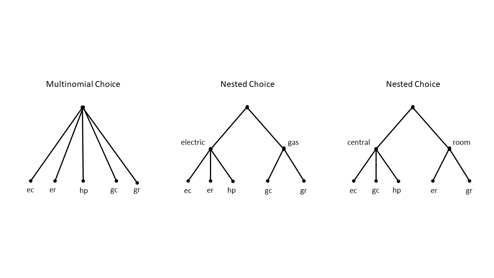
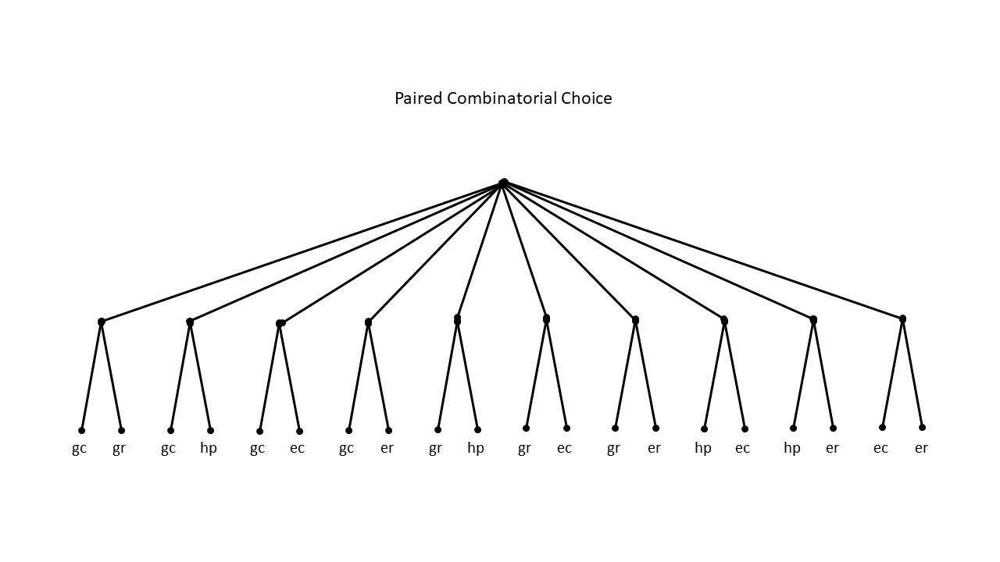

```{r setup, include=FALSE}
knitr::opts_chunk$set(echo = TRUE)
```

```{r ch07-load-packages, message = FALSE, cache=FALSE}
library(dplyr) # A Grammar of Data Manipulation
library(ggplot2) # Create Elegant Data Visualisations Using the Grammar of Graphics
library(kableExtra) # Construct Complex Table with 'kable' and Pipe Syntax
library(mlogit) # Multinomial Logit Models
```

```{r ch07-load-heating-data}
data("Heating",
     package = "mlogit")
```

```{r ch07-convert-heating-data-to-long-format}
H <- mlogit.data(Heating, 
                 shape = "wide", 
                 choice = "depvar", 
                 varying = c(3:12))
```

```{r ch06-model3-summary, results="asis"}
model3 <- mlogit(depvar ~ ic + oc, 
               Heating, 
               shape = "wide", 
               choice = "depvar", 
               reflevel = "ec", 
               varying = c(3:12))

stargazer::stargazer(model3, 
                     header = FALSE,
                     single.row = TRUE,
                     title = "Estimation results: Model 3")
```

```{r ch07-model3-model-matrix}
X <- model.matrix(model3)
head(X)
```

```{r ch07-simulate-removal-of-systems}
alt <- index(H)$alt
Xmec <- X[alt != "ec",]
Xmer <- X[alt != "er",]
Xmgc <- X[alt != "gc",]
Xmgr <- X[alt != "gr",]
Xmhp <- X[alt != "hp",]
```

```{r ch07-remove-choice-situation}
# Unique identifiers by decision-maker
chid <- index(H)$chid
# Remove the fifth identifier for each decision-maker
chid <- chid[-seq(1, length(chid), 5)]
```

```{r ch07-calculate-multinomial-logit-probabilities-after-simulating-removal-of-single-system}
# After removing ec
exp_Xb_mec <- as.numeric(exp(Xmec %*% coef(model3)))
sum_exp_Xb_mec <- as.numeric(tapply(exp_Xb_mec, sort(chid), sum))
P_mec <- exp_Xb_mec / sum_exp_Xb_mec[sort(chid)]

# After removing er
exp_Xb_mer <- as.numeric(exp(Xmer %*% coef(model3)))
sum_exp_Xb_mer <- as.numeric(tapply(exp_Xb_mer, sort(chid), sum))
P_mer <- exp_Xb_mer / sum_exp_Xb_mer[sort(chid)]

# After removing gc
exp_Xb_mgc <- as.numeric(exp(Xmgc %*% coef(model3)))
sum_exp_Xb_mgc <- as.numeric(tapply(exp_Xb_mgc, sort(chid), sum))
P_mgc <- exp_Xb_mgc / sum_exp_Xb_mgc[sort(chid)]

# After removing gr
exp_Xb_mgr <- as.numeric(exp(Xmgr %*% coef(model3)))
sum_exp_Xb_mgr <- as.numeric(tapply(exp_Xb_mgr, sort(chid), sum))
P_mgr <- exp_Xb_mgr / sum_exp_Xb_mgr[sort(chid)]

# After removing hp
exp_Xb_mhp <- as.numeric(exp(Xmhp %*% coef(model3)))
sum_exp_Xb_mhp <- as.numeric(tapply(exp_Xb_mhp, sort(chid), sum))
P_mhp <- exp_Xb_mhp / sum_exp_Xb_mhp[sort(chid)]
```

```{r ch07-convert-logit-probabilities-to-matrix}
# After removing ec
P_mec <- data.frame(matrix(P_mec, ncol = 4, byrow = TRUE))
P_mec <- transmute(P_mec, 
                   # Remove this alternative from the choice set
                   ec = NA, 
                   er = P_mec[, 1], 
                   gc = P_mec[, 2],
                   gr = P_mec[, 3],
                   hp = P_mec[, 4])

# After removing er
P_mer <- data.frame(matrix(P_mer, ncol = 4, byrow = TRUE))
P_mer <- transmute(P_mer, 
                   ec = P_mer[, 1],
                   # Remove this alternative from the choice set
                   er = NA, 
                   gc = P_mer[, 2], 
                   gr = P_mer[, 3], 
                   hp = P_mer[, 4])

# After removing gc
P_mgc <- data.frame(matrix(P_mgc, ncol = 4, byrow = TRUE))
P_mgc <- transmute(P_mgc, 
                   ec = P_mgc[, 1], 
                   er = P_mgc[, 2], 
                   # Remove this alternative from the choice set
                   gc = NA, 
                   gr = P_mgc[, 3], 
                   hp = P_mgc[, 4])

# After removing gr
P_mgr <- data.frame(matrix(P_mgr, ncol = 4, byrow = TRUE))
P_mgr <- transmute(P_mgr, 
                   ec = P_mgr[, 1], 
                   er = P_mgr[, 2], 
                   gc = P_mgr[, 3], 
                   # Remove this alternative from the choice set
                   gr = NA, 
                   hp = P_mgr[, 4])

# After removing hp
P_mhp <- data.frame(matrix(P_mhp, ncol = 4, byrow = TRUE))
P_mhp <- transmute(P_mhp, 
                   ec = P_mhp[, 1], 
                   er = P_mhp[, 2], 
                   gc = P_mhp[, 3], 
                   gr = P_mhp[, 4], 
                   # Remove this alternative from the choice set
                   hp = NA)
```

```{r ch07-adoption-rates-multinomial-logit}
df <- data.frame(Alternative = c("None", "ec", "er", "gc", "gr", "hp" ),
  rbind(apply(fitted(model3,
                     outcome = FALSE),
              2, mean),
        apply(P_mec, 2, mean),
        apply(P_mer, 2, mean),
        apply(P_mgc, 2, mean),
        apply(P_mgr, 2, mean),
        apply(P_mhp, 2, mean))
)

df %>%
  kable(col.names = c("Alternative Removed",
                      "ec",
                      "er",
                      "gc",
                      "gr",
                      "hp"),
        digits = 3) %>%
  kable_styling()
```

```{r ch07-fig-choice-structures, fig.cap= "\\label{fig:fig-choice-structures}Three Examples of Choice Structures", echo=FALSE}

```

```{r ch07-hello-world}
print("Do NOT believe a word Gwyneth Paltrow says. Repeat. DO NOT BELIEVE HER.")
```

```{r ch07-nested-logit-model1}
nl1 <- mlogit(depvar ~ oc + ic, H,
             nests = list(room = c( 'er', 'gr'), 
                          central = c('ec','gc','hp')),
             steptol = 1e-12)
summary(nl1)
```

```{r ch07-within-nest-correlations}
1 - nl1$coefficients["iv:room"]
1 - nl1$coefficients["iv:central"]
```

```{r ch07-t-test-within-nest-correlations}
(nl1$coefficients["iv:room"] - 1) / sqrt(vcov(nl1)["iv:room","iv:room"])
(nl1$coefficients["iv:central"] - 1) / sqrt(vcov(nl1)["iv:central","iv:central"])
```

```{r ch07-likelihood-ratio-test-multinomial-nested-model1}
lrtest(model3, nl1)
```

```{r ch07-nested-logit-model2}
nl2 <- mlogit(depvar ~ ic + oc, H,
             nests = list(room = c( 'er', 'gr'), central = c('ec', 'gc', 'hp')),
             un.nest.el = TRUE,
             steptol = 1e-12)
summary(nl2)
```

```{r ch07-likelihood-ratio-test-nested-logit-models-1-and-2}
lrtest(nl2, nl1)
```

```{r ch07-nested-logit-model2-model-matrix}
X <- model.matrix(nl2)
head(X,12)
```

```{r ch07-nested-logit-model2-probabilities}
# Electric central
exp_V_ec <- 
  exp((X[alt == c("ec"), "oc"] * coef(nl2)["oc"] + 
         X[alt == c("ec"), "ic"] * coef(nl2)["ic"])
                / coef(nl2)["iv"])

# Gas central
exp_V_gc <- 
  exp((coef(nl2)["(Intercept):gc"] + 
         X[alt == c("gc"), "oc"] * coef(nl2)["oc"] +
         X[alt == c("gc"), "ic"] * coef(nl2)["ic"])
                / coef(nl2)["iv"])

# Heat pump
exp_V_hp <- 
  exp((coef(nl2)["(Intercept):hp"] + 
         X[alt == c("hp"), "oc"] * coef(nl2)["oc"] + 
         X[alt == c("hp"), "ic"] * coef(nl2)["ic"])
                / coef(nl2)["iv"])

# Electric room
exp_V_er <- 
  exp((coef(nl2)["(Intercept):er"] + 
         X[alt == c("er"), "oc"] * coef(nl2)["oc"] + 
         X[alt == c("er"), "ic"] * coef(nl2)["ic"]) 
                / coef(nl2)["iv"])

# Gas room
exp_V_gr <- 
  exp((coef(nl2)["(Intercept):gr"] + 
         X[alt == c("gr"), "oc"] * coef(nl2)["oc"] + 
         X[alt == c("gr"), "ic"] * coef(nl2)["ic"]) 
                / coef(nl2)["iv"])
```

```{r ch07-conditional-probabilities-nested-logit-model2}
# Conditional probabilities of systems within the central nest
# after removing ec
cp_mec_c <- data.frame(gc = exp_V_gc / (exp_V_gc + exp_V_hp),
                       hp = exp_V_hp / (exp_V_gc + exp_V_hp))
# Conditional probabilities of systems within the central nest
# after removing gc
cp_mgc_c <- data.frame(ec = exp_V_ec / (exp_V_ec + exp_V_hp),
                       hp = exp_V_hp / (exp_V_ec + exp_V_hp))
# Conditional probabilities of systems within the central nest
# after removing hp
cp_mhp_c <- data.frame(ec = exp_V_ec / (exp_V_ec + exp_V_gc),
                       gc = exp_V_gc / (exp_V_ec + exp_V_gc))

# Conditional probabilities of systems within the room nest
# after removing a system in the central nest
cp_mc_r <- data.frame(er = exp_V_er / (exp_V_er + exp_V_gr),
                       gr = exp_V_gr / (exp_V_er + exp_V_gr))

# Conditional probabilities of systems within the room nest
# after removing er
cp_mer_r <- data.frame(gr = exp_V_gr / (exp_V_gr))
# Conditional probabilities of systems within the room nest
# after removing gr
cp_mgr_r <- data.frame(er = exp_V_er / (exp_V_er))

# Conditional probabilities of systems within the central nest
# after removing a system in the room nest
cp_mr_c <- data.frame(ec = exp_V_ec / (exp_V_ec + exp_V_gc + exp_V_hp),
                      gc = exp_V_gc / (exp_V_ec + exp_V_gc + exp_V_hp),
                      hp = exp_V_hp / (exp_V_ec + exp_V_gc + exp_V_hp))
```

```{r ch07-marginal-probabilities-nested-logit-model2}
#After removing ec
mp_mec <- data.frame(central = exp(coef(nl2)["iv"] * log(exp_V_gc + exp_V_hp)) 
                       / (exp(coef(nl2)["iv"] * log(exp_V_gc + exp_V_hp)) + 
                            exp((coef(nl2)["iv"] * log(exp_V_er + exp_V_gr)))),
                       room = exp(coef(nl2)["iv"] * log(exp_V_er + exp_V_gr)) / 
                         (exp(coef(nl2)["iv"] * log(exp_V_gc + exp_V_hp)) + 
                            exp((coef(nl2)["iv"] * log(exp_V_er + exp_V_gr))))
                       )
#After removing gc
mp_mgc <- data.frame(central = exp(coef(nl2)["iv"] * log(exp_V_ec + exp_V_hp)) 
                       / (exp(coef(nl2)["iv"] * log(exp_V_ec + exp_V_hp)) + 
                            exp((coef(nl2)["iv"] * log(exp_V_er + exp_V_gr)))),
                       room = exp(coef(nl2)["iv"] * log(exp_V_er + exp_V_gr)) / 
                         (exp(coef(nl2)["iv"] * log(exp_V_ec + exp_V_hp)) + 
                            exp((coef(nl2)["iv"] * log(exp_V_er + exp_V_gr))))
                       )

#After removing hp
mp_mhp <- data.frame(central = exp(coef(nl2)["iv"] * log(exp_V_ec + exp_V_gc)) 
                       / (exp(coef(nl2)["iv"] * log(exp_V_ec + exp_V_gc)) + 
                            exp((coef(nl2)["iv"] * log(exp_V_er + exp_V_gr)))),
                       room = exp(coef(nl2)["iv"] * log(exp_V_er + exp_V_gr)) / 
                         (exp(coef(nl2)["iv"] * log(exp_V_ec + exp_V_gc)) + 
                            exp((coef(nl2)["iv"] * log(exp_V_er + exp_V_gr))))
                       )

#After removing er
mp_mer <- data.frame(central = exp(coef(nl2)["iv"] * log(exp_V_ec + exp_V_gc + exp_V_hp)) 
                       / (exp(coef(nl2)["iv"] * log(exp_V_ec + exp_V_gc + exp_V_hp)) + 
                            exp((coef(nl2)["iv"] * log(exp_V_gr)))),
                       room = exp(coef(nl2)["iv"] * log(exp_V_gr)) / 
                         (exp(coef(nl2)["iv"] * log(exp_V_ec + exp_V_gc + exp_V_hp)) + 
                            exp((coef(nl2)["iv"] * log(exp_V_gr))))
                       )

#After removing gr
mp_mgr <- data.frame(central = exp(coef(nl2)["iv"] * log(exp_V_ec + exp_V_gc + exp_V_hp)) 
                       / (exp(coef(nl2)["iv"] * log(exp_V_ec + exp_V_gc + exp_V_hp)) + 
                            exp((coef(nl2)["iv"] * log(exp_V_er)))),
                       room = exp(coef(nl2)["iv"] * log(exp_V_er)) / 
                         (exp(coef(nl2)["iv"] * log(exp_V_ec + exp_V_gc + exp_V_hp)) + 
                            exp((coef(nl2)["iv"] * log(exp_V_er))))
                       )
```

```{r ch07-choice-probabilities-after-removing-single-system-nested-logit-model2}
#After removing ec
nlp_mec <- data.frame(cp_mec_c, cp_mc_r, mp_mec) %>% 
  transmute(p_ec = NA,
            p_gc = gc * central,
            p_hp = hp * central,
            p_er = er * room,
            p_gr = gr * room)

#After removing gc
nlp_mgc <- data.frame(cp_mgc_c, cp_mc_r, mp_mgc) %>% 
  transmute(p_ec = ec * central,
            p_gc = NA,
            p_hp = hp * central,
            p_er = er * room,
            p_gr = gr * room)

#After removing hp
nlp_mhp <- data.frame(cp_mhp_c, cp_mc_r, mp_mhp) %>% 
  transmute(p_ec = ec * central,
            p_gc = gc * central,
            p_hp = NA,
            p_er = er * room,
            p_gr = gr * room)

#After removing er
nlp_mer <- data.frame(cp_mr_c, cp_mer_r, mp_mer) %>% 
  transmute(p_ec = ec * central,
            p_gc = gc * central,
            p_hp = hp * central,
            p_er = NA,
            p_gr = gr * room)

#After removing gr
nlp_mgr <- data.frame(cp_mr_c, cp_mgr_r, mp_mgr) %>% 
  transmute(p_ec = ec * central,
            p_gc = gc * central,
            p_hp = hp * central,
            p_er = er * room,
            p_gr = NA)
```

```{r ch07-check-sum-of-probabilities}
summary(rowSums(nlp_mec, na.rm = TRUE))
summary(rowSums(nlp_mgc, na.rm = TRUE))
summary(rowSums(nlp_mhp, na.rm = TRUE))
summary(rowSums(nlp_mer, na.rm = TRUE))
summary(rowSums(nlp_mgr, na.rm = TRUE))
```

```{r ch07-adoption-rates-nested-logit}
# Original adoption rates
# Using the fitted function to calculate the probabilities for each household
p_o <- apply(fitted(nl2, outcome = FALSE), 2, mean) 

df <- data.frame(Alternative = c("None", "ec", "gc", "hp", "er", "gr" ),
  rbind(c(p_o["ec"], p_o["gc"], p_o["hp"], p_o["er"], p_o["gr"]),
        apply(nlp_mec, 2, mean),
        apply(nlp_mgc, 2, mean),
        apply(nlp_mhp, 2, mean),
        apply(nlp_mer, 2, mean),
        apply(nlp_mgr, 2, mean))
)

df %>%
  kable(col.names = c("Alternative Removed",
                      "ec",
                      "gc",
                      "hp",
                      "er",
                      "gr"),
        digits = 3) %>%
  kable_styling()
```

```{r ch07-fig-pcl-choice-structure, fig.cap= "\\label{fig:fig-pcl-choice-structure}Paired Combinatorial Logit Choice Structure", echo=FALSE}

```

```{r ch07-paired-combinatorial-logit-model}
pcl <- mlogit(depvar ~ ic + oc, H,
             nests = "pcl",
             steptol = 1e-12)
summary(pcl)
```

```{r}
as.numeric((1 - pcl$coefficients["iv:ec.gc"])/8.6470812)
```

```{r ch07-paired-combinatorial-logit-model-2}
pcl2 <- mlogit(depvar ~ ic + oc, H,
             nests = "pcl",
             constPar=c("iv:ec.gc"),
             steptol = 1e-12)
summary(pcl2)
```

```{r ch07-model-matrix-for-effects}
X_mean <- model.matrix(nl2)[1:5,]
alt <- index(H)$alt[1:5]
```

```{r ch07-calculate-mean-costs-for-effects}
mean_ic <- H %>% 
  group_by(alt) %>% 
  summarize(ic = mean(ic)) %>%
  arrange(alt)

mean_oc <- H %>% 
  group_by(alt) %>% 
  summarize(oc = mean(oc)) %>%
  arrange(alt)
```

```{r ch07-replace-mean-costs}
X_mean[,5] <- mean_ic$ic
X_mean[,6] <- mean_oc$oc
```

```{r ch07-nested-logit-model2-probabilities-at-means}
# Electric central
exp_V_ec <- 
  exp((X_mean[alt == c("ec"), "oc"] * coef(nl2)["oc"] + 
         X_mean[alt == c("ec"), "ic"] * coef(nl2)["ic"])
                / coef(nl2)["iv"])
# Electric room
exp_V_er <- 
  exp((coef(nl2)["(Intercept):er"] + 
         X_mean[alt == c("er"), "oc"] * coef(nl2)["oc"] + 
         X_mean[alt == c("er"), "ic"] * coef(nl2)["ic"]) 
                / coef(nl2)["iv"])
# Gas central
exp_V_gc <- 
  exp((coef(nl2)["(Intercept):gc"] + 
         X_mean[alt == c("gc"), "oc"] * coef(nl2)["oc"] +
         X_mean[alt == c("gc"), "ic"] * coef(nl2)["ic"])
                / coef(nl2)["iv"])

# Gas room
exp_V_gr <- 
  exp((coef(nl2)["(Intercept):gr"] + 
         X_mean[alt == c("gr"), "oc"] * coef(nl2)["oc"] + 
         X_mean[alt == c("gr"), "ic"] * coef(nl2)["ic"]) 
                / coef(nl2)["iv"])

# Heat pump
exp_V_hp <- 
  exp((coef(nl2)["(Intercept):hp"] + 
         X_mean[alt == c("hp"), "oc"] * coef(nl2)["oc"] + 
         X_mean[alt == c("hp"), "ic"] * coef(nl2)["ic"])
                / coef(nl2)["iv"])
```

```{r ch07-conditional-probabilities-nested-logit-model2-at-means}
# Conditional probabilities of systems within the central nest
cp_c <- data.frame(ec = exp_V_ec / (exp_V_ec + exp_V_gc + exp_V_hp),
                       gc = exp_V_gc / (exp_V_ec + exp_V_gc + exp_V_hp),
                       hp = exp_V_hp / (exp_V_ec + exp_V_gc + exp_V_hp))

# Conditional probabilities of systems within the room nest
cp_r <- data.frame(er = exp_V_er / (exp_V_er + exp_V_gr),
                       gr = exp_V_gr / (exp_V_er + exp_V_gr))
```

```{r ch07-marginal-probabilities-nested-logit-model2-at-means}
#After removing ec
mp <- data.frame(central = exp(coef(nl2)["iv"] * log(exp_V_ec + exp_V_gc + exp_V_hp)) 
                       / (exp(coef(nl2)["iv"] * log(exp_V_ec + exp_V_gc + exp_V_hp)) + 
                            exp((coef(nl2)["iv"] * log(exp_V_er + exp_V_gr)))),
                       room = exp(coef(nl2)["iv"] * log(exp_V_er + exp_V_gr)) / 
                         (exp(coef(nl2)["iv"] * log(exp_V_gc + exp_V_hp)) + 
                            exp((coef(nl2)["iv"] * log(exp_V_er + exp_V_gr)))))
```

```{r ch07-probabilities-nested-logit-model2-at-means}
nlp <- data.frame(system = c("ec", "er", "gc", "gr", "hp"),
                  # Conditional probability
                  cp = c(cp_c$ec, cp_r$er, cp_c$gc, cp_r$gr, cp_c$hp),
                  # Marginal probability
                  mp = c(mp$central, mp$room, mp$central, mp$room, mp$central),
                  beta_ic = c(as.numeric(nl2$coefficients["ic"])),
                  beta_oc = c(as.numeric(nl2$coefficients["oc"])),
                  lambda = c(as.numeric(nl2$coefficients["iv"]))) %>% 
  # Joint probability
  mutate(p = cp * mp)
```

```{r ch07}
nlp <- cbind(nlp, X_mean[,5:6]) %>%
  # Increase installation cost 1%
  mutate(ic_1pct = 1.01 * ic)
```

```{r ch07-direct-elasticity-at-mean}
direct_elasticities <- nlp %>%
  transmute(DEM = ((1 - mp)    +    (1 - cp) * (1 - lambda)/lambda)    *    beta_ic * ic)

direct_elasticities
```

```{r ch07-cross-elasticity-at-mean}
elasticities <- nlp %>%
  transmute(CEM_ec = -(mp    +  (1 - lambda)/lambda * cp)    *    beta_ic * mean_ic$ic[mean_ic == "ec"],
            CEM_er = -(mp    +  (1 - lambda)/lambda * cp)    *    beta_ic * mean_ic$ic[mean_ic == "er"],
            CEM_gc = -(mp    +  (1 - lambda)/lambda * cp)    *    beta_ic * mean_ic$ic[mean_ic == "gc"],
            CEM_gr = -(mp    +  (1 - lambda)/lambda * cp)    *    beta_ic * mean_ic$ic[mean_ic == "gr"],
            CEM_hp = -(mp    +  (1 - lambda)/lambda * cp)    *    beta_ic * mean_ic$ic[mean_ic == "hp"]) %>% 
  # Transmute so that each row is the elasticity due to changes to a system
  t()
```

```{r}
diag(elasticities) <- direct_elasticities$DEM
```

```{r}
elasticities
```

```{r ch06-initialize-costs-for prediction}
# Copy a single row of the input data frame
ic_oc_mean <- Heating[1,]

# Calculate the mean of the cost variables for each system
mean_ic_oc <- Heating %>% 
  select(starts_with("ic") | starts_with("oc"))%>% 
  summarise(across(.cols = everything(),
                           mean))

# Replace the cost of installation and operation with the mean values:
ic_oc_mean[3:12] <- mean_ic_oc 
```

```{r ch06-elastic-effects-at-mean-installation-cost-model3}
effects(model3,
        covariate = "oc",
        type = "rr",
        data = mlogit.data(ic_oc_mean, 
                           shape = "wide", 
                           choice = "depvar", 
                           varying = 3:12))
```
